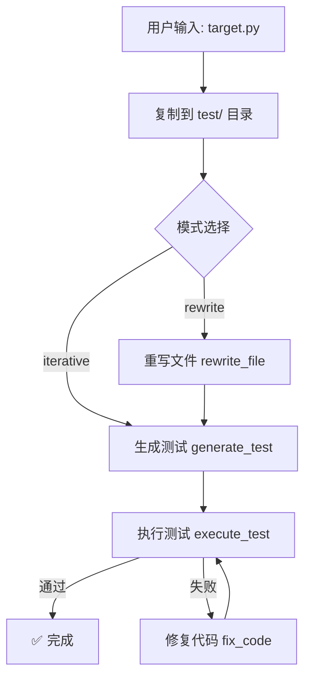

# 🧪 DeepFix-Agent: AI 驱动的 Python 代码自动修复器

[English](./README.md) | [中文](./README-zh.md)

[](https://www.python.org/)
[](https://opensource.org/licenses/MIT)
[](https://langchain-ai.github.io/langgraph/)
[](https://github.com/xue-yufan/DeepFix-Agent/stargazers)
[](https://github.com/xue-yufan/DeepFix-Agent/issues)

**DeepFix-Agent** 是一个智能代理，能够自动生成单元测试、检测 Python 代码中的 Bug，并使用 **DeepSeek** 大语言模型自动修复。支持**逐函数迭代修复**和**全文件重写**两种模式（类似 Claude Code）。

---

## ✨ 特性

- 🔍 **自动提取函数** – 自动检测 Python 文件中的所有顶层函数
- 🧪 **生成全面测试** – 创建覆盖边界情况的 `pytest` 测试套件
- 🔧 **两种修复模式** – 逐函数迭代修复 / 一次性全文件重写
- 💾 **断点持久化** – 通过 SQLite 支持中断后恢复运行
- 📁 **隔离输出** – 所有结果输出到 `test/` 目录，原始文件不受影响
- 🧠 **结构化 JSON 输出** – 利用 DeepSeek 的 JSON 模式生成可靠修复

---

## 📦 安装

### 环境要求

- Python 3.11 或更高版本
- [uv](https://docs.astral.sh/uv/)（推荐）或 pip

### 克隆项目 & 安装依赖

```bash
git clone https://github.com/xue-yufan/DeepFix-Agent.git
cd DeepFix-Agent
```

**使用 uv 安装（最快）：**

```bash
uv sync
```

**或使用 pip 安装：**

```bash
pip install -r requirements.txt
```

### 🔑 配置

在项目根目录创建 `.env` 文件，并添加你的 DeepSeek API 密钥：

```env
DEEPSEEK_API_KEY=sk-xxxxxxxxxxxxxxxxx
DEEPSEEK_BASE_URL=https://api.deepseek.com/v1
DEEPSEEK_MODEL=deepseek-chat
DEEPSEEK_TEMPERATURE=0.3
DEEPSEEK_MAX_TOKENS=4096
```

> ⚠️ **切勿将 `.env` 提交到版本控制** – 该文件已添加到 `.gitignore`。

---

## 💻 使用方式

### 模式一：修复单个函数（迭代式）

```bash
uv run python scripts/run_single.py --file target.py --func divide
```

### 模式二：修复文件中所有函数（迭代式）

```bash
uv run python scripts/run_single.py --file target.py
```

### 模式三：一次性重写整个文件（Claude Code 风格）

```bash
uv run python scripts/run_single.py --file target.py --mode rewrite
```

### 输出结构

所有生成的文件保存在 `test/<文件名（不含扩展名）>/` 下：

```text
test/
└── target/
    ├── target.py          # 修复后的版本
    └── test_target.py     # 生成的测试文件
```

原始文件**完全不受影响**。

---

## 🧠 架构



| 组件 | 说明 |
| --- | --- |
| **LangGraph** | 代理工作流状态机 |
| **DeepSeek** | 用于代码分析与生成的大语言模型 |
| **pytest** | 测试执行引擎 |
| **SqliteSaver** | 断点持久化，支持恢复运行 |

---

## 🤝 参与贡献

欢迎贡献！请提交 Issue 或 Pull Request。

1. **Fork** 本仓库
2. **创建**特性分支 (`git checkout -b feature/amazing`)
3. **提交**更改 (`git commit -m 'Add some amazing feature'`)
4. **推送**到分支 (`git push origin feature/amazing`)
5. **发起** Pull Request

---

## 📄 许可证

基于 **MIT 许可证** 分发。详见 [LICENSE](LICENSE)。

---

## 🙏 致谢

- [LangChain & LangGraph](https://langchain-ai.github.io/langgraph/)
- [DeepSeek](https://deepseek.com) 提供的强大 API
- [pytest](https://pytest.org) 测试框架

> **免责声明：** 本工具使用 AI 生成代码。在部署到生产环境之前，请务必人工审查所有更改。
