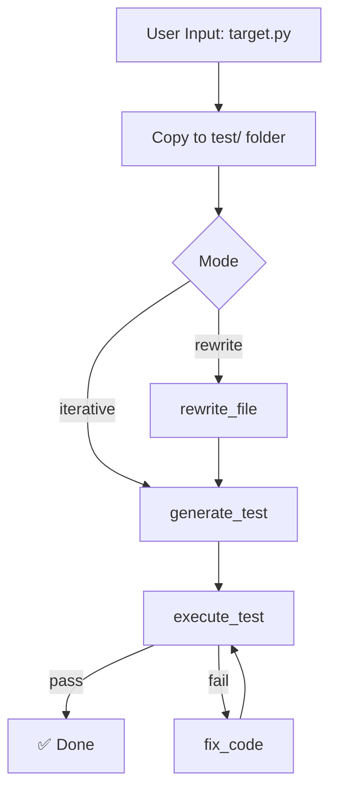

# 🧪 DeepFix-Agent: AI-Powered Python Code Auto-Fixer

[English](./README.md) | [中文](./README-zh.md)

[](https://www.python.org/)
[](https://opensource.org/licenses/MIT)
[](https://langchain-ai.github.io/langgraph/)
[](https://github.com/xue-yufan/DeepFix-Agent/stargazers)
[](https://github.com/xue-yufan/DeepFix-Agent/issues)

**DeepFix-Agent** is an intelligent agent that automatically generates unit tests, detects bugs in Python code, and fixes them using **DeepSeek** LLM. It supports both **iterative function-by-function repair** and **full-file rewrite** (similar to Claude Code).

---

## ✨ Features

- 🔍 **Auto-extract functions** – detects all top-level functions in any Python file
- 🧪 **Generate comprehensive tests** – creates `pytest` suites covering edge cases
- 🔧 **Two repair modes** – iterative function-by-function or one-shot full rewrite
- 💾 **Persistent checkpoint** – resumes interrupted runs via SQLite
- 📁 **Isolated output** – all results go to `test/` folder, original file untouched
- 🧠 **Structured JSON output** – uses DeepSeek's JSON mode for reliable fixes

---

## 📦 Installation

### Prerequisites

- Python 3.11 or higher
- [uv](https://docs.astral.sh/uv/) (recommended) or pip

### Clone & Setup

```bash
git clone https://github.com/xue-yufan/DeepFix-Agent.git
cd DeepFix-Agent
```

**Install with uv (fastest):**

```bash
uv sync
```

**Or with pip:**

```bash
pip install -r requirements.txt
```

### 🔑 Configuration

Create a `.env` file in the project root and add your DeepSeek API key:

```env
DEEPSEEK_API_KEY=sk-xxxxxxxxxxxxxxxxx
DEEPSEEK_BASE_URL=https://api.deepseek.com/v1
DEEPSEEK_MODEL=deepseek-chat
DEEPSEEK_TEMPERATURE=0.3
DEEPSEEK_MAX_TOKENS=4096
```

> ⚠️ **Never commit `.env` to version control** – it's already ignored by `.gitignore`.

---

## 💻 Usage

### Mode 1: Fix a single function (iterative)

```bash
uv run python scripts/run_single.py --file target.py --func divide
```

### Mode 2: Fix all functions in a file (iterative)

```bash
uv run python scripts/run_single.py --file target.py
```

### Mode 3: Rewrite entire file at once (Claude Code style)

```bash
uv run python scripts/run_single.py --file target.py --mode rewrite
```

### Output

All generated files are saved under `test/<filename_without_ext>/`:

```text
test/
└── target/
    ├── target.py          # Fixed version
    └── test_target.py     # Generated tests
```

The original file remains **completely untouched**.

---

## 🧠 Architecture



| Component | Description |
| --- | --- |
| **LangGraph** | State machine for agent workflow |
| **DeepSeek** | LLM for code analysis & generation |
| **pytest** | Test execution engine |
| **SqliteSaver** | Checkpoint persistence for resume |

---

## 🤝 Contributing

Contributions are welcome! Please open an Issue or submit a Pull Request.

1. **Fork** the repository
2. **Create** a feature branch (`git checkout -b feature/amazing`)
3. **Commit** your changes (`git commit -m 'Add some amazing feature'`)
4. **Push** to the branch (`git push origin feature/amazing`)
5. **Open** a Pull Request

---

## 📄 License

Distributed under the **MIT License**. See [LICENSE](LICENSE) for more information.

---

## 🙏 Acknowledgements

- [LangChain & LangGraph](https://langchain-ai.github.io/langgraph/)
- [DeepSeek](https://deepseek.com) for the powerful API
- [pytest](https://pytest.org) for the testing framework

> **Disclaimer:** This tool uses AI to generate code. Always review changes manually before deploying to production.
